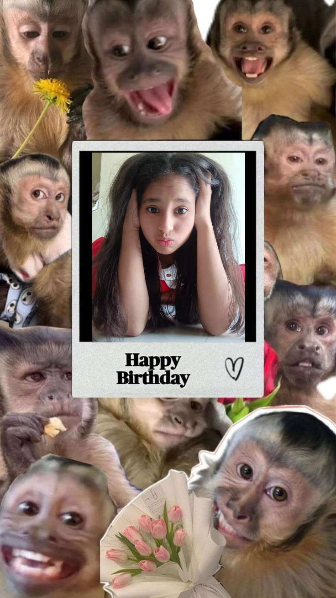
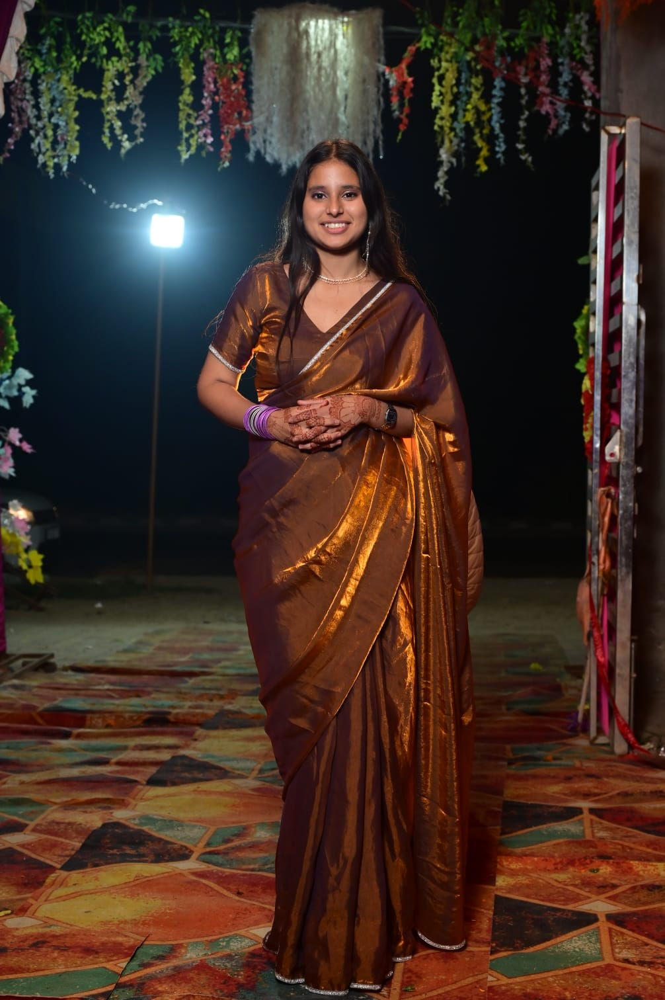
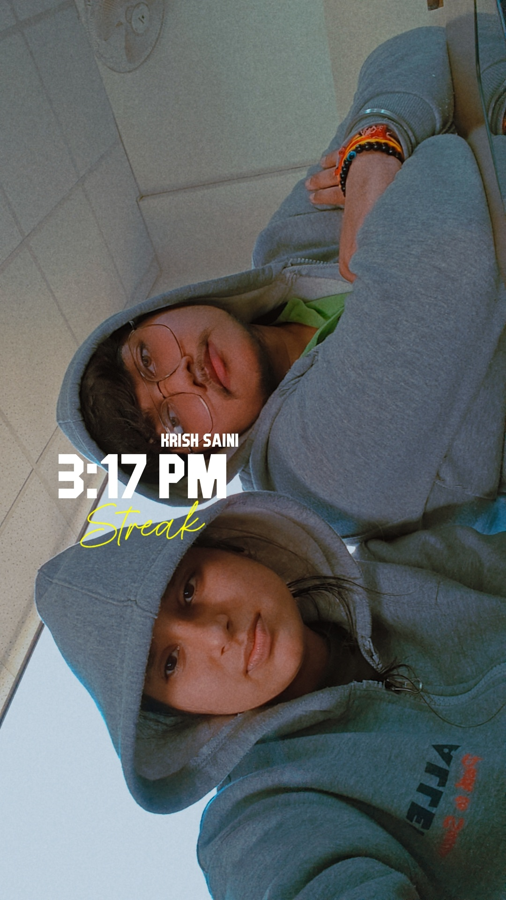

<!DOCTYPE html>
<html lang="en">
<head>
    <meta charset="UTF-8">
    <meta name="viewport" content="width=device-width, initial-scale=1.0">
    <title>Happy Birthday Tannu!</title>
    
</head>
<body>

    <!-- Ready Button Overlay Screen -->
    

        <button class="ready-btn" onclick="triggerBurst(event)">Ready!</button>
    

    <!-- Main Website Scroll Wrapper -->
    

        <!-- Slide 1: Side-by-Side Full Length Hero Presentation -->
        <section class="slide" id="slide1">
            

                <!-- Left Full Length Picture (img4.jpg) -->
                
            

            

                <h1>Happy Birthday, Tannu! ✨</h1>
                
Welcome to your special day web corner. Scroll down to see your memories...

            

        </section>

        <!-- Slide 2: Corners Configuration & Perfect Message -->
        <section class="slide" id="slide2">
            

                
                
            

            
            

                <h2>"Happy Birthday to my precious beautiful girl"</h2>
            

            
            

                
            

        </section>

        <!-- Slide 3: Two Horizontal Hoodie Pictures Side by Side -->
        <section class="slide" id="slide3">
            <h2 style="color: #e65100; font-size: 2.5rem;">Memories Together 🎯</h2>
            

                
                
            

        </section>

        <!-- Slide 4: Celebration Finale -->
        <section class="slide" id="slide4">
            
🎉 🎂 🥳 🎈

            <h2>Let's Celebrate!</h2>
            
Wishing you a year filled with endless laughter, success, and beautiful moments.

        </section>

    

    
</body>
</html>
